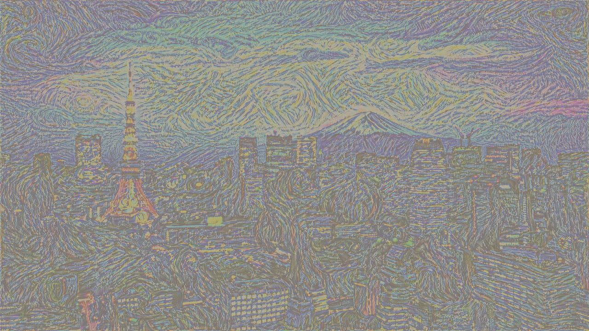

# Neural Style Transfer — Gatys et al. (2015)

*What if Van Gogh had painted Tokyo?*


*Tokyo skyline × Starry Night — 10,000 optimization steps on RTX 4060*

---

## Overview

Full implementation of Neural Style Transfer from scratch in PyTorch, based on Gatys, Ecker & Bethge (2015). Given a content image and a style image, the algorithm synthesizes a new image that preserves the semantic structure of the content while adopting the texture and visual feel of the style.

Deployed as an interactive Streamlit app with preset images, custom upload support, and an adjustable style strength slider.

**Live demo:** [nst-by-divya.streamlit.app](https://nst-by-divya.streamlit.app)

---

## How It Works

VGG19 (pretrained, frozen) is used purely as a feature extractor — not for classification.

- **Content:** MSE between feature maps of the generated image and content image at `conv4_2`
- **Style:** MSE between Gram matrices at five layers — `conv1_1`, `conv2_1`, `conv3_1`, `conv4_1`, `conv5_1`
- **Gram matrix:** G = FFᵀ, capturing filter co-activation statistics with no spatial information
- **Optimization:** X (the generated image) is the variable — VGG19 weights are frozen throughout

```
L_total = α · L_content + β · L_style
```

Gradients flow back through the frozen network to update X's pixel values directly.

---

## Running Locally

```bash
git clone git@github.com:ayvid7550/neural-style-transfer.git
cd neural-style-transfer
pip install -r requirements.txt
streamlit run app.py
```

> GPU strongly recommended — 1000 steps takes ~2 min on RTX 4060, ~30 min on CPU.

---

## Results

| Content | Style | Steps |
|--------|-------|-------|
| Tokyo skyline | Starry Night | 10,000 |
| Tokyo skyline | The Scream | 3,000 |

Best hyperparameters: `α=0.01`, `β=1e7`, Adam `lr=0.01`

---

## Stack

`PyTorch` `torchvision` `VGG19` `Streamlit` `Pillow` `CUDA`

---

## Repository Structure

```
├── app.py                      # Streamlit web app
├── nst.py                      # Core NST logic
├── NST implementation.ipynb    # Step-by-step notebook with math derivations
├── requirements.txt
├── hero.png                    # 10,000 step showcase output
├── style/                      # Preset style paintings
└── content/                    # Preset content images
```

---

## Paper

Gatys, L. A., Ecker, A. S., & Bethge, M. (2015). *A Neural Algorithm of Artistic Style.* [arXiv:1508.06576](https://arxiv.org/abs/1508.06576)
